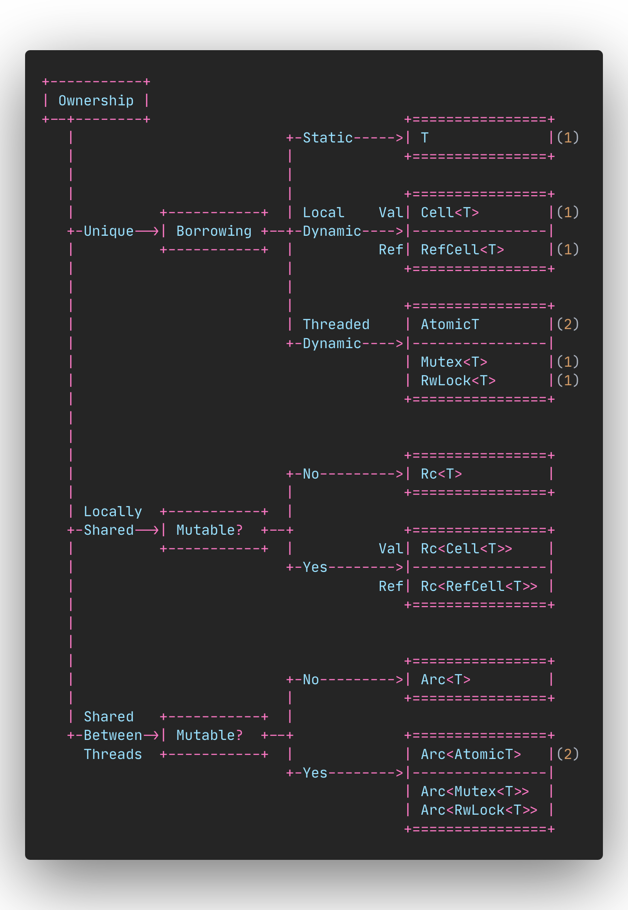

> Tests:

```shell
$ cargo test
```

## Rust Ownership and Borrowing: A Comprehensive Guide

This project is a comprehensive guide to understanding Rust's ownership and borrowing model. Rust's unique approach to memory safety without a garbage collector is what sets it apart from other programming languages.



### 1. Ownership
The root of Rust's memory safety model is "Ownership." Ownership in Rust ensures that every piece of data in a program has a single owner at any given time, which eliminates the possibility of data races and ensures memory safety. The project branches into different types of ownership and borrowing strategies:

### 2. Unique Ownership
- **Static Ownership:** When ownership is static, the data is owned by a single entity throughout the program's execution.
  - **T:** Represents a type `T` that is owned by a single owner. The ownership does not change, and no borrowing occurs. The value can be either mutable or immutable, but the ownership is unique and static.

- **Borrowing:** When ownership is temporary and can be passed around via borrowing.
  - **Local Borrowing:** Refers to borrowing within a single thread.
    - **Cell<T>:** A `Cell<T>` allows interior mutability. It enables you to mutate the value even if the `Cell<T>` itself is immutable.
    - **RefCell<T>:** A `RefCell<T>` also allows interior mutability but is more flexible than `Cell<T>` because it dynamically checks borrow rules at runtime.
  - **Threaded Borrowing:** Refers to borrowing that works across threads.
    - **AtomicT:** Represents atomic types that allow safe concurrent mutation across threads.
    - **Mutex<T>:** A `Mutex<T>` is a mutual exclusion primitive that allows multiple threads to access the same data, ensuring that only one thread can access the data at a time.
    - **RwLock<T>:** An `RwLock<T>` allows multiple readers or one writer at a time, offering more fine-grained concurrency control than a `Mutex<T>`.

### 3. Locally Shared Ownership
This branch deals with data that is shared locally within a single thread.
- **Mutable?**: Asks whether the data needs to be mutable.
  - **No:** If not mutable, you use:
    - **Rc<T>:** A reference-counted pointer that allows multiple ownership within a single thread but only for immutable data.
  - **Yes:** If mutable:
    - **Val (Value):**
      - **Rc<Cell<T>>:** Combines `Rc<T>` for multiple ownership with `Cell<T>` for interior mutability.
    - **Ref (Reference):**
      - **Rc<RefCell<T>>:** Combines `Rc<T>` for multiple ownership with `RefCell<T>` for interior mutability, allowing mutation of the value through shared ownership.

### 4. Shared Ownership Between Threads
This branch deals with data that is shared between threads.
- **Mutable?**: Asks whether the data needs to be mutable.
  - **No:** If not mutable, you use:
    - **Arc<T>:** An atomic reference-counted pointer that allows multiple ownership across threads for immutable data.
  - **Yes:** If mutable:
    - **Arc<AtomicT>:** Combines `Arc<T>` for thread-safe multiple ownership with `AtomicT` for atomic operations.
    - **Arc<Mutex<T>>:** Combines `Arc<T>` for thread-safe multiple ownership with `Mutex<T>` for synchronized access to mutable data.
    - **Arc<RwLock<T>>:** Combines `Arc<T>` for thread-safe multiple ownership with `RwLock<T>` for synchronized access that allows multiple readers or one writer.

### 5. Key Points
- **T:** Represents any type with unique, static ownership.
- **Cell<T> and RefCell<T>:** Allow for interior mutability within a single thread.
- **Rc<T> and Arc<T>:** Enable reference counting, with `Rc` used for single-threaded scenarios and `Arc` for multi-threaded scenarios.
- **AtomicT, Mutex<T>, and RwLock<T>:** Provide mechanisms for safe concurrent access to data across threads.

### Project Structure
This project is divided into different modules, each covering a specific aspect of Rust's ownership and borrowing model.

#### 1. Unique Ownership
- **Static Ownership**:
  - **Example**: Basic Ownership (`T`)
  - **Example Code**: `src/unique/static.rs`

#### 2. Borrowing
- **Local Borrowing**:
  - **Value Borrowing (`Cell<T>`)**: Demonstrates how `Cell<T>` allows mutation even when the owner is immutable.
  - **Reference Borrowing (`RefCell<T>`)**: Explains runtime borrow checking with `RefCell<T>`.
  - **Threaded Borrowing**:
    - **Atomic Operations (`AtomicT`)**: Safe concurrency without locks.
    - **Synchronization Primitives (`Mutex<T>` and `RwLock<T>`)**: Synchronizing access across threads.
  - **Example Code**: `src/borrowing/local_cell.rs`, `src/borrowing/local_refcell.rs`, `src/borrowing/threaded_atomic.rs`, `src/borrowing/threaded_mutex_rwlock.rs`

#### 3. Locally Shared Ownership
- **Immutable (`Rc<T>`)**: Reference counting for single-threaded scenarios.
- **Mutable (`Rc<Cell<T>)` and `Rc<RefCell<T>)`**: Shared mutability in single-threaded scenarios.
- **Example Code**: `src/shared/local_rc.rs`, `src/shared/local_rc_cell_refcell.rs`

#### 4. Shared Ownership Between Threads
- **Immutable (`Arc<T>`)**: Sharing immutable data between threads.
- **Mutable (`Arc<AtomicT>`, `Arc<Mutex<T>`, `Arc<RwLock<T>`)**: Thread-safe shared ownership with synchronization.
- **Example Code**: `src/shared/threaded_arc.rs`, `src/shared/threaded_arc_atomic_mutex_rwlock.rs`

#### 5. Advanced Concepts and Edge Cases
- **Interior Mutability**:
  - **Example Code**: `src/advanced/interior_mutability.rs`
- **Concurrency Patterns**:
  - **Producer-Consumer, Worker Threads**:
  - **Example Code**: `src/advanced/concurrency_patterns.rs`

### Conclusion
This repo aims to be a valuable resource for anyone looking to master Rust's ownership and borrowing model. It provides practical examples, detailed explanations, and a structured approach to learning these fundamental concepts.

Happy coding and learning Rust!
